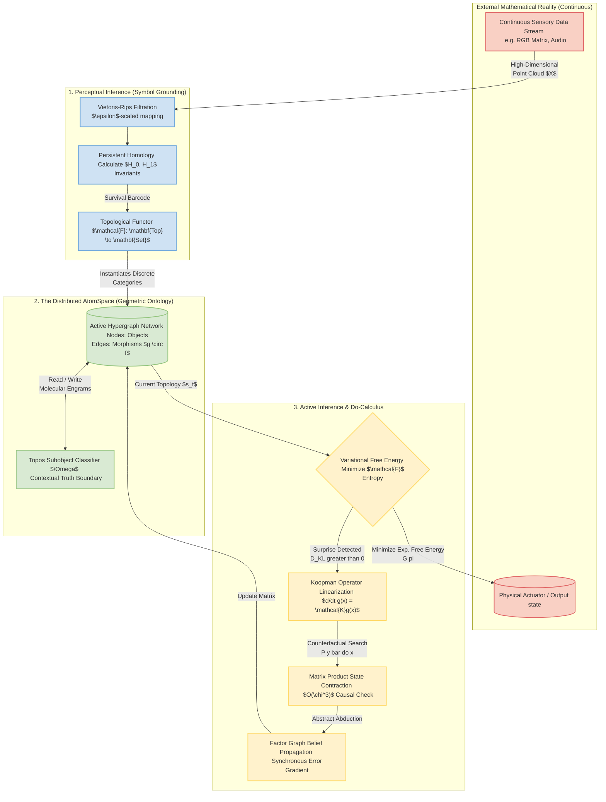

# The SAGE Architecture Diagram

*(This describes the iconic diagram for the paper, equivalent to the "Encoder/Decoder" block in Attention Is All You Need)*

## Diagram Caption: 
**Figure 1: The SAGE Architecture.** Continuous environmental data is passed through Vietoris-Rips filtration to derive topological invariants (Persistent Homology). Surviving invariants are mapped via Functor directly into the discrete categorical matrix (Distributed AtomSpace) as explicit Objects and Morphisms, resolving the Symbol Grounding problem without human proxy. Inference evaluates via Forney Factor Graph Message Passing, where Variational Free Energy minimization strictly governs all internal causal adjustments and external physical interventions ($do(x)$). Complex cyclical simulations are linearly compressed via Koopman Operators and bounded spatially via Matrix Product State (MPS) tensor contractions, granting $O(1)$ causal broadcasting capabilities to the global topological manifold limit.
